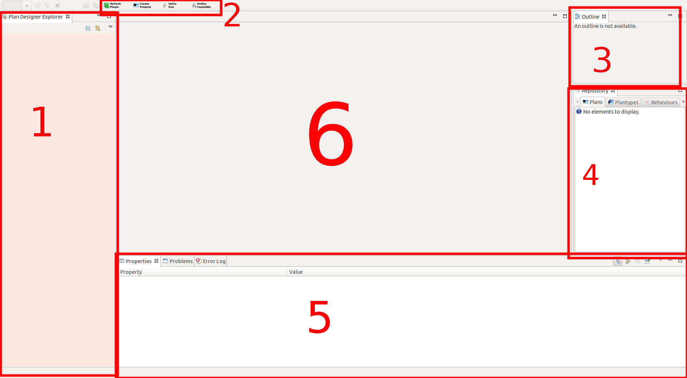
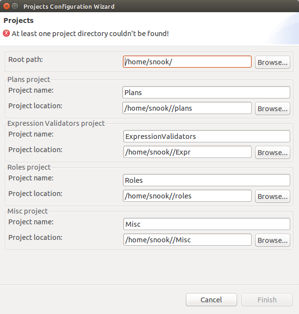

# PlanDesigner for ALICA

**PlanDesigner at the first start**

The PlanDesigner is a Eclipse RCP

	1. Workspace directory where all plans can be find

	2. Create buttons and refresh plugin  
		* Refresh Plugin 
		* Create Projects = create a new project and update the workspace directory
		* Define roles = here you can define roles for your robots and will be create a roleset
		* Define Capabillity =  here you can define capabillities for your roles

	3. Outline windows where you can see the whole editor of point 6

	4. Here will be all created Plans, Plantypes, Behaviours and Tasks 

	5. The Propertie windows for more options 

	6. Editor

**Create Project**

1. The *Root Path* should be the same as the DOMAIN_CONFIG_FOLDER path. It is the path to your *etc/* folder.

2. *Plans project* is the path to your plan folder. Something like this: *etc/plans/*

3. *Expressions Validators project* is the path to the folder where all *.cpp* files will be generated.

4. *Roles project same* the same as point 2 *etc/roles/*

5. *Misc project same* the same as point 2 *etc/Misc/*

**Work with PlanDesigner** 

