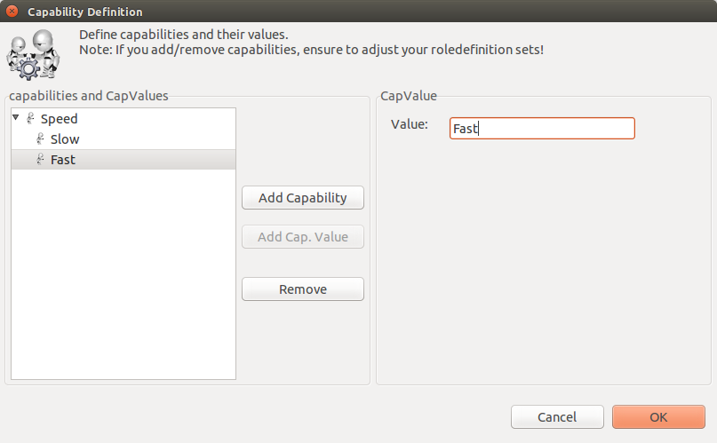
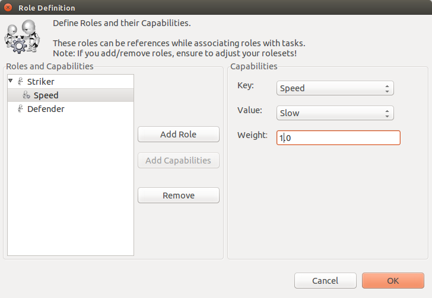
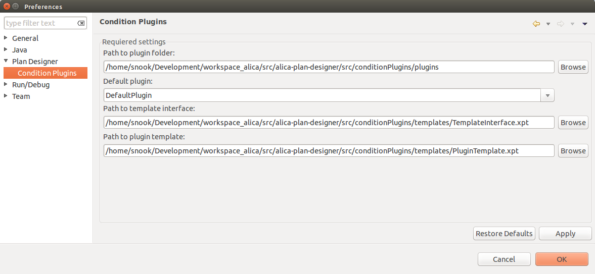

# PlanDesigner for ALICA

**PlanDesigner at the first start**

The PlanDesigner is a Eclipse RCP

	1. Workspace directory where all plans can be find

	2. Create buttons and refresh plugin  
		* Refresh Plugin 
		* Create Projects = create a new project and update the workspace directory
		* Define roles = here you can define roles for your robots.
		* Define Capability =  here you can define capabilities for your roles.

	3. Outline window where you can see the whole editor of point 6

	4. Here will be all created Plans, Plantypes, Behaviours and Tasks 

	5. The Propertie windows for more options 

	6. Editor

**Create Project**

	1. The *Root Path* should be the same as the DOMAIN_CONFIG_FOLDER path. It is the path to your *etc/* folder.

	2. *Plans project* is the path to your plan folder. Something like this: *etc/plans/*

	3. *Expressions Validators project* is the path to the folder where all *.cpp* files will be generated.

	4. *Roles project* the same as point 2 *etc/roles/*

	5. *Misc project* the same as point 2 *etc/Misc/*

**Define Capability**

Here you can define capabilites and there cap values. (self-explaining) :-)

**Define Roles**

This window is dependent to *Define Capability*. You can create new roles and add the defined capabilities with a weight to them. (self-explaining) :-)

**Set the DefaultPlugin**

To ensure that the code generation works, you should set the correct plug-in under Window -> Preferences -> Plan Designer -> Conditional Plugins. As in the picture the trails should be set properly.

	* Path to plugin = alica-plan-designer/src/conditionPlugins/plugins
	* Default plugin should be set to DefaultPlugin
	* Path to template interface = alica-plan-designer/src/conditionPlugins/templates/TemplateInterface.xpt
	* Path to plugin template = alica-plan-designer/src/conditionPlugins/templates/PluginTemplate.xpt

**Work with PlanDesigner** 

You can now drop the elements in the editor windows by clicking the element in the "Palette", this doesnt working with drag and drop (click go to the location where you want to drop it and click again). In the property tab you will find all attributes of the actual element. You can change for example the name or write a comment. To auto generate the code, **right click -> Code Generation -> Generate all expression validator (generated from the plan included all plans) or Generate expression validator (only generate the code for the plan)**
	

